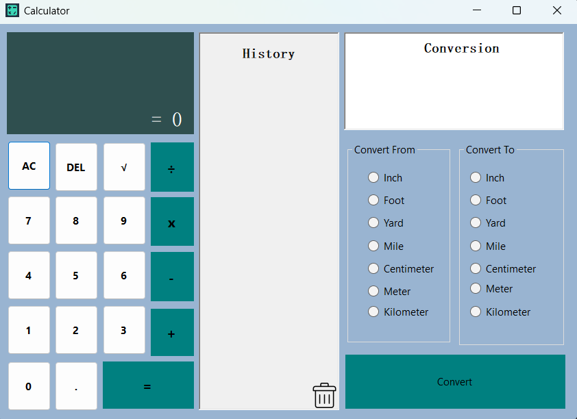

# Calculator with Unit Conversions

## Overview
This project is a C#-based calculator that includes unit conversion features. It allows users to perform standard arithmetic calculations while also converting between different units of length. The system supports both metric and imperial measurement systems, enabling seamless conversion from one unit to another and vice versa.

## Features
- **Basic Arithmetic Operations**: Addition, subtraction, multiplication, and division.
- **Length Unit Conversions**:
  - **Imperial System**: Inch, Foot, Yard, Mile
  - **Metric System**: Centimeter, Meter, Kilometer
- **Bi-Directional Conversions**: Convert from and to any supported unit.
- **User-Friendly Interface**: Simple and intuitive design for easy calculations.
- **Error Handling**: Validations to prevent invalid inputs and ensure accurate conversions.

## About the Project
This project was developed during my second year of college for the subject *Computer Programming 3* using C#. It was designed to help users quickly convert between metric and imperial units while performing calculations.

## Technology Stack
- **Programming Language**: C#
- **Development Environment**: Visual Studio
- **User Interface**: Windows Forms (WinForms)

## Installation and Usage
1. Clone this repository:
   ```sh
   git clone https://github.com/yourusername/calculator-with-conversions.git
   ```
2. Open the project in Visual Studio.
3. Build and run the application.
4. Enter values and select the units to convert.

## Future Enhancements
- Add more unit types (e.g., weight, volume, temperature conversions).
- Implement a history log for past calculations.
- Introduce a dark mode for better UI experience.

## License
This project is open-source and available under the MIT License.

---



